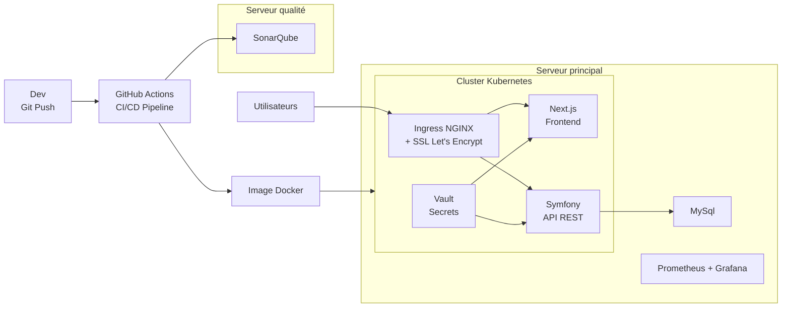

# Superviser et Assurer le Développement

La Petite Maison de l'Épouvante — Lead Developer — Avril 2026

---
layout: image-right
image: https://images.unsplash.com/photo-1519389950473-47ba0277781c?w=800&q=80
---

# Sommaire

 

1. Introduction
2. Phase 1 — Processus de développement
3. Phase 2 — Implémentation technique
4. Phase 3 — Résultats du développement
5. Phase 4 — Plan de remédiation
6. Conclusion

---
layout: center
background: '#ffffff'
---

Partie 1

# Introduction

---
layout: image-right
image: https://images.unsplash.com/photo-1542744173-8e7e53415bb0?w=800&q=80
---

# Contexte

**La Petite Maison de l'Épouvante**

- Fanzine horreur fondé il y a 10 ans · 4 magasins (France + Londres)
- Festival annuel & collectif de production **Evil Ed**

 

**Legacy IT**

- Site vitrine sans e-commerce · échanges CSV · 1 technicien

 

**Mission**

Livrer la v1 de la plateforme **Blockbuster** via un processus DevSecOps.

---

# Enjeux

**La plateforme Blockbuster — Ce qu'il faut construire**

 

  

    
E-commerce

  

  

    
✓ Produits physiques

    
✓ Produits numériques

    
✓ Liseuse intégrée

  

  

    
Communauté

  

  

    
✓ Espace d'échange & troc

    
✓ Chat passionnés

    
✓ Notifications perso.

  

  

    
Intelligence

  

  

    
✓ Recommandations

    
✓ Comportement utilisateur

  

  

    
Contraintes

  

  

    
✓ Sécurité prioritaire

    
✓ Hébergement Europe

    
✓ Conformité RGAA

  

---
layout: center
background: '#ffffff'
---

Partie 2

# Processus de développement

---

# Cycle de vie du développement

  
1. Planifier

  
User stories Backlog Sprint planning

  
2. Code

  
TDD Code review PHPStan/ESLint

  
3. Build & Test

  
Tests unitaires Trivy scan Docker build Analyse de la complexité cyclomatique

  
4. Deployer

  
Kubernetes Vault secrets Let's Encrypt

  
5. Opérer et Monitorer

  
Prometheus · Grafana · Alertmanager · Logs (Loki)

  
6. Retours & Itération

  
Métriques ISO 25010 · Rétrospective · Remédiation

---

# Indicateurs qualité — ISO 25010

**4 métriques pour piloter la qualité et éviter la dette technique**

 

| # | Indicateur | Caractéristique ISO 25010 |
|---|-----------|--------------------------|
| 1 | Temps de réponse | Performance |
| 2 | Taux de disponibilité | Fiabilité |
| 3 | Couverture de tests | Maintenabilité |
| 4 | Vulnérabilités détectées | Sécurité |

---
layout: image-right
image: https://images.unsplash.com/photo-1504868584819-f8e8b4b6d7e3?w=800&q=80
---

# Indicateur 1 — Performance

**Temps de réponse des API**

- Cible : < 200 ms (p95) en conditions normales
- Mesuré via : Siege, Prometheus
- Seuil d'alerte : > 500 ms

 

**Lien dette technique**

Sans ce suivi : dégradation progressive → refactorisation totale (coût x10)

Avec ce suivi : optimisations incrémentales → coût maîtrisé

---
layout: image-right
image: https://images.unsplash.com/photo-1558494949-ef010cbdcc31?w=800&q=80
---

# Indicateur 2 — Fiabilité

**Taux de disponibilité (uptime)**

- Cible : ≥ 99,5 %
- Mesuré via : Grafana, Alertmanager
- MTTR cible : < 1 h

 

**Lien dette technique**

Sans ce suivi : incidents récurrents → correctifs d'urgence non documentés

Avec ce suivi : stabilité prouvée → confiance dans l'architecture

---
layout: image-right
image: https://images.unsplash.com/photo-1516116216624-53e697fedbea?w=800&q=80
---

# Indicateur 3 — Maintenabilité

**Couverture de tests & dette technique**

- Couverture cible : ≥ 80 %
- Dette technique : niveau maximal PHPStan + 0 erreur ESLint
- Complexité cyclomatique surveillée par sonarcube avec la note de A

 

**Lien dette technique**

Sans ce suivi : code non testé = code intouchable → paralysie évolutive

Avec ce suivi : code confiant → refactoring sans risque

---
layout: image-right
image: https://images.unsplash.com/photo-1563986768609-322da13575f3?w=800&q=80
---

# Indicateur 4 — Sécurité

**Vulnérabilités détectées**

- Cible : 0 CVE critique en production
- Mesuré via : Trivy (images Docker), Composer et Trivy (dépendances)
- Délai de correction CVE critique : < 24 h

 

**Lien dette technique**

Sans ce suivi : dépendances obsolètes → migration forcée coûteuse

Avec ce suivi : mises à jour régulières → coût de migration nul

---

# Pipeline CI/CD — 2 workflows

**Stratégie de déploiement automatisé**

 

  

    
Workflow 1

    
Push & Pull Requests

  

  

    
✓ Qualité du code

    
✓ Scan des dépendances

    
✓ Tests unitaires

  

  

    → Validation avant merge
  

  

    
Workflow 2

    
Mise en production

  

  

    
✓ Qualité + Dépendances + Tests

    
✓ Build image Docker

    
✓ Scan image (Trivy)

    
✓ Deploy Kubernetes

  

  

    → Déploiement automatisé
  

---

# Workflow 1 — Push & Pull Requests

**Pipeline de validation du code**

 

  
Push / PR

→

  
Qualité Code

  
PHPStan ESLint

→

  
Dépendances

  
Composer Trivy

→

  
Tests

  
Unitaires Couverture

→

  
Merge OK

 
 

**Objectif** : garantir la qualité du code avant toute intégration dans la branche principale

**Durée moyenne** : 1 minute

---

# Workflow 2 — Mise en production

**Pipeline de déploiement complet**

 

  

    
Push sur main

  

  
→

  

    
Qualité

    
PHPStan + ESLint

  

  
→

  

    
Dépendances

    
Composer + Trivy

  

  

    
Tests

    
Unitaires + Couverture

  

  
→

  

    
Build

    
Image Docker

  

  
→

  

    
Scan Image

    
Trivy

  

  
→

  

    
Deploy

    
Kubernetes

  

 

**Objectif** : déploiement sécurisé et automatisé en production

**Durée moyenne** : 6-8 minutes

---

# Blocages automatiques dans les pipelines

**Mécanismes de protection qualité & sécurité**

 

  

    
Qualité du code

  

  

    
<strong>Erreur PHPStan</strong>

    
<strong>Erreur ESLint</strong>

    
<strong>Analyse cyclomatique</strong>

  

  

    
Sécurité

  

  

    
<strong>CVE critique</strong>

    
<strong>CVE haute</strong>

  

  

    
Tests

  

  

    
<strong>Couverture < 80%</strong>

    
<strong>Tests en échec</strong>

  

 

  <strong>✅ Tous les critères respectés</strong> → Le code peut être mergé / déployé

  <strong>💡 Prévention dette technique</strong> : Chaque blocage empêche l'introduction de code qui nécessiterait une correction future coûteuse

---

# Profils & formation de l'équipe

  
Dev Backend

  
REST APIs · TDD · SQL · PHPStan · Test · Git

  

    <ul>
      <li>Formation TDD & Clean Code </li>
    </ul>
  

  
Dev Frontend

  
React/Vue · Responsive · A11y · Test · Tests composants · Git

  

  <ul>
    <li>
      Formation RGAA / Accessibilité numérique (Access42) </li>
    <li>
      Certification OpenJS Node.js / React
    </li>
  </ul>
  

  
DevOps / QA

  
Kubernetes · CI/CD · Vault · Siege

  

  <ul>
    <li>
      Certification <strong>CKA</strong> (Certified Kubernetes Administrator)
    </li>
  </ul>
  

  
Ingénieur Sécu.

  
Trivy · RGPD · OWASP · CVE

  

    <ul>
      <li>
        Certification <strong>OWASP </strong>
      </li>
    </ul>
  

  
Lead Developer

  
Agile/Scrum · Architecture · ISO 25010 · Reporting

  

    <ul>
      <li>
        Formation ISO 25010 & métriques qualité logicielle 
      </li>
    </ul>
  

  <strong>Plan de formation transverse</strong> : workshops DevSecOps mensuels · revues de code croisées · documentation interne partagée

---
layout: center
background: '#ffffff'
---

Partie 3

# Implémentation technique

---

# User Stories — Backlog fonctionnel

| # | En tant que… | Je veux… | Critères d'acceptation |
|---|-------------|----------|------------------------|
| US-01 | Client | Consulter le catalogue avec filtres | Filtres catégorie/prix/stock · Réponse < 200 ms · Responsive |
| US-02 | Client | Voir la fiche détaillée d'un article | Description, prix · Réponse < 200 ms |
| US-03 | Client | Ajouter des articles au panier et passer commande | Panier persistant · Paiement HTTPS · Confirmation e-mail |
| US-04 | Gestionnaire | Créer et modifier des articles dans le catalogue | Formulaire titre/description/prix/stock · Validation obligatoire · Historique des modifications |

 

> **Critères transverses** : couverture de tests ≥ 80 % · 0 CVE critique · disponibilité ≥ 99,5 % · conformité RGPD

---
layout: image-right
image: https://images.unsplash.com/photo-1558494949-ef010cbdcc31?w=800&q=80
---

# Architecture technique

- **Cluster Kubernetes** : orchestration en production
- **HashiCorp Vault** : gestion centralisée des secrets (DB credentials, API keys)
- **Let's Encrypt** : certificats SSL/TLS automatisés via cert-manager
- **Ingress NGINX** : routage et load balancing
- **Prometheus + Grafana** : Monitoring
- **Sonacube** : Analyse qualité du code

**Avantages**
- **Scalabilité automatique**
- **Secrets jamais en clair dans le code**
- **Certificats renouvelés automatiquement**

---

# Schéma — Architecture technique

---

# Stack technique — Next.js

**Framework frontend pour l'interface e-commerce**

- **Next.js** : React framework avec SSR (Server-Side Rendering)
- **Node.js** : runtime pour le serveur Next.js
- **Déploiement** : containerisé dans Kubernetes

 

**Difficultés & solutions**

  
 Configuration serveur Node

  

    
Next.js nécessite un serveur Node actif sur le port 3000

    

      node server.js
    

  

  
 Variables d'environnement

  

    
Les env vars du container doivent être déclarées dans :

    

      next.config.js
    

    
→ Nécessaire pour le runtime

  

---

# Stack technique — Symfony

**Framework backend pour l'API e-commerce**

- **Symfony** : PHP framework pour les API REST
- **Apache** : serveur web pour exécuter l'application
- **Déploiement** : containerisé dans Kubernetes

 

**Difficultés & solutions**

  
Fichier .env obligatoire

  

    
Malgré l'usage de variables d'environnement du container, Symfony nécessite un fichier .env

    

      .env
    

    
→ Configuration requise par le framework

  

  
 Variables Apache

  

    
Apache doit être configuré pour passer les variables d'environnement à PHP

    

      SetEnv VAR_NAME value
    

    
→ Configuration dans httpd.conf ou .htaccess

  

---

# Infrastructure — Kubernetes (K8s)

**Orchestration des conteneurs**

- **Kubernetes (K8s)** : orchestration complète des conteneurs
- **Installation locale** : Minikube pour le développement
- **Choix stratégique** : K8s plutôt que K3s

 

**Expérience d'implémentation**

  
Installation facilitée

  

    
Difficultés assez faibles lors de la mise en place

    
Configuration relativement simple avec Minikube

    
→ Prise en main rapide

  

  
Choix K8s vs K3s

  

    
Préférence pour Kubernetes complet

    
Tester les composants dans des conditions proches du réel

    
→ Environnement de production réaliste

  

---

# Infrastructure — HashiCorp Vault

**Gestion des secrets et credentials**

- **HashiCorp Vault** : stockage sécurisé des secrets
- **Intégration K8s** : injection de secrets dans les pods
- **Déploiement** : installé sur le cluster Kubernetes

 

**Expérience d'implémentation**

  
Installation simple

  

    
Installation de Vault elle-même sans difficulté majeure

    
Déploiement via Helm chart standard

    
→ Mise en place rapide

  

  
Authentification K8s → Vault

  

    
Véritable défi : authentifier les services K8s à Vault

    
Configuration des policies et des rôles pour chaque service

    
→ Gestion de l'accès aux secrets complexe

  

---

# Infrastructure — Let's Encrypt

**Gestion automatique des certificats SSL/TLS**

- **Let's Encrypt** : certificats SSL/TLS gratuits et automatisés
- **Cert-manager** : opérateur Kubernetes pour la gestion des certificats
- **Intégration Ingress** : injection automatique dans NGINX Ingress

 

**Expérience d'implémentation**

  
Configuration simple

  

    
Installation de cert-manager sans difficulté

    
Configuration des Issuers Let's Encrypt aisée

    
→ Mise en place rapide et efficace

  

  
Injection dans Ingress

  

    
Intégration transparente avec NGINX Ingress

    
Renouvellement automatique des certificats

    
→ Configuration simplifiée via annotations

  

---

# Qualité du code — SonarQube

**Analyse statique et détection de bugs**

- **SonarQube** : plateforme d'analyse de qualité du code
- **Scan automatique** : intégration dans la pipeline CI/CD
- **Métriques** : bugs, vulnérabilités, code smells, couverture

 

**Expérience d'implémentation**

  
Consommation de ressources

  

    
SonarQube consomme beaucoup de ressources (CPU, RAM)

    
Installation nécessaire sur un VPS dédié

    
→ Infrastructure supplémentaire requise

  

  
Retour des résultats

  

    
Difficulté à retourner les résultats à la pipeline

    
Configuration complexe pour arrêter la pipeline en cas d'échec

    
→ Intégration CI/CD délicate

  

---

# Monitoring — Prometheus & Grafana

**Observabilité et métriques en temps réel**

- **Prometheus** : collecte et stockage des métriques (CPU, RAM, latence)
- **Grafana** : tableaux de bord et visualisation des métriques

 

**Expérience d'implémentation**

  
Installation facilitée

  

    
Installation de Prometheus et Grafana sans difficulté majeure

    
Configuration des dashboards et alertes rapide

    
→ Mise en place simple et efficace

  

  
Déploiement externe

  

    
Prometheus et Grafana ne sont pas déployés dans Kubernetes

    
Installation sur infrastructure séparée

    
→ Architecture monitoring indépendante

  

---

# Tests — PHPUnit & Jest

**Frameworks de tests unitaires**

- **PHPUnit** : framework de tests pour le backend Symfony (PHP)
- **Jest** : framework de tests pour le frontend Next.js (JavaScript)
- **Intégration CI/CD** : exécution automatique dans les workflows

 

**Expérience d'implémentation**

  
Configuration spécifique requise

  

    
Configuration spécifique nécessaire pour PHPUnit et Jest

    
Particulièrement complexe sur Symfony avec PHPUnit

    
→ Point bloquant lors de la mise en place

  

---

# Tests de charge

**Scénarios de test**

- **Charge normale** : 100 utilisateurs simultanés
- **Pic de trafic** : 500 utilisateurs (Black Friday)

 

**Outils & métriques**
- **Siege** : simulation de charge réaliste
- **Métriques surveillées** :
  - Temps de réponse p95 < 200 ms
  - Taux d'erreur < 0,1 %
  - Auto-scaling K8s : validation HPA

---
layout: center
background: '#ffffff'
---

Partie 4

# Résultats du développement

---
layout: center
---

# Démonstration

  <video controls width="800" class="rounded-lg shadow-lg">
    <source src="/videos/demo.mp4" type="video/mp4">
    Votre navigateur ne supporte pas la lecture de vidéos.
  </video>

---
layout: center
---

# Résultat

  

---

# Synthèse complète des résultats

 

| Domaine | Métrique | Objectif | Résultat | Status |
|---------|----------|----------|----------|--------|
| **Performance** | Disponibilité | ≥ 99,5% | 99,7% | ✅ |
| **Tests** | Couverture de code | ≥ 80% | 30% (183 tests) | ⚠️ |
| **Qualité** | PHPStan / ESLint | 0 erreur | 0 erreur | ✅ |
| **Sécurité** | CVE critiques | 0 | 0 | ✅ |
| **Infrastructure** | Kubernetes | A | A | ✅ |
| **Dépendances** | Paquets à jour | 100% | Certains obsolètes | ⚠️ |

---

# Résultats de performance détaillés

**Tests de charge et disponibilité**

 

| Composant | Temps de réponse | Disponibilité | Status |
|-----------|------------------|---------------|--------|
| **Frontend** | 0.03 secs | 100.00 % | ✅ |
| **API** | 0.05 secs | 100.00 % | ✅ |

 

  <strong>Objectifs atteints</strong> : temps de réponse < 200 ms ✅ · disponibilité ≥ 99,5% ✅

---
layout: center
background: '#ffffff'
---

Partie 5

# Plan de remédiation

---

# Vulnérabilités et points d'amélioration

**Analyse détaillée**

  

    
Sécurité — CVE et dépendances

    

      
• Quelques CVE mineures détectées (non bloquantes)

      
• Certains paquets nécessitent une mise à jour

      
→ Actions : mise à jour des images et des packets

    

  

  

    
Tests — Couverture insuffisante

    

      
• Couverture actuelle : 30% (objectif : ≥ 80%)

      
• 183 tests unitaires fonctionnels

      
→ Actions : augmenter la couverture

    

  

  

    
Observabilité — Architecture à consolider

    

      
• Prometheus et Grafana déployés hors Kubernetes

      
• Absence de centralisation des logs (Loki manquant)

      
→ Actions : migrer vers K8s, implémenter Loki

    

  

---

# Recommandations priorisées

**Roadmap d'amélioration continue**

  

    
Court terme

    
(Sprint actuel)

  

  

    

      
1.

      
Augmenter couverture tests (30% → 80%)

    

    

      
2.

      
Mettre à jour image les images dockers

    

    

      
3.

      
Mettre à jour les paquets obsolètes

    

  

  

    
Moyen terme

    
(1-2 mois)

  

  

    

      
4.

      
Implémenter Loki (centralisation logs)

    

    

      
5.

      
Migrer Prometheus/Grafana dans K8s

    

  

  

    
Long terme

    
(Trimestre)

  

  

    

      
6.

      
Scan DAST avec OWASP ZAP

    

  

---
layout: center
background: '#ffffff'
---

Partie 6

# Conclusion

---

# Conclusion

  
Réussites

  

    
• Infrastructure Kubernetes opérationnelle et sécurisée

    
• Gestion des secrets avec Vault + certificats Let's Encrypt automatisés

    
• 2 workflows CI/CD automatisés (Push/PR + Production)

    
• Analyse de qualité du code (PHPStan + ESLint) et sécurité (Trivy)

    
• 0 vulnérabilité critique en production

    
• Objectifs de performance et disponibilité atteints

  

  
Prochaines étapes

  

    
• Extension de la couverture avec tests E2E

    
• Amélioration continue de la posture de sécurité

    
• Mise en place du chaos engineering

  

  
Impact business

  
Plateforme e-commerce prête pour la production avec confiance

---
layout: center
---

# Questions ?

 

Merci

---
layout: center
---
